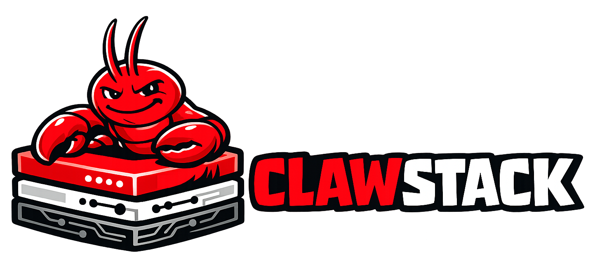

# 🦞 ClawStack - Fullstack AI-Agent-Assisted Development Template

<p align="center"></p>

<p align="center">
  <strong>The first fullstack template designed for AI-agent-assisted development.</strong><br/>
  FastAPI + React + Postgres + Terraform, pre-wired with context files and OpenClaw skills so your agent understands your project from the first commit.
</p>

<p align="center">
  <a href="LICENSE"></a>
  <a href="https://github.com/Benja-Pauls/ClawStack/actions/workflows/ci.yml"></a>
  <a href="https://github.com/Benja-Pauls/ClawStack/releases/latest"></a>
  
  <a href="https://github.com/Benja-Pauls/ClawStack/stargazers"></a>
</p>

<p align="center">
  <a href="#quick-start">Quick Start</a> ·
  <a href="#three-tiers">Three Tiers</a> ·
  <a href="#deploy-to-aws">Deploy to AWS</a> ·
  <a href="#skills">Skills</a> ·
  <a href="#configuration">Config</a> ·
  <a href="#faq">FAQ</a>
</p>

---

## Why ClawStack?

You're building a fullstack app with an AI coding agent — Claude Code, Cursor, Copilot, or something new that shipped last Tuesday. But every session starts cold. The agent doesn't know your project structure, your naming conventions, or why you chose Alembic over raw SQL migrations. It hallucinates file paths and scaffolds patterns you don't use.

Existing templates give you app scaffolding. Existing agent frameworks give you tooling. But the connection between "here's the app" and "here's how to work on it" is usually missing — left for you to rediscover every session.

**ClawStack bridges that gap.** It ships with context files your agent can read immediately, structured JSON logging it can parse programmatically, and — with OpenClaw — automation skills that let it watch your dev servers, fix errors, scaffold endpoints, and deploy to AWS without asking you how.

<table>
<tr>
<td width="50%">

**📋 SKILL.md Context Files**<br/>
Plain markdown files in `.skills/` that teach any agent your project structure, conventions, and workflows — no special format or lock-in.

</td>
<td width="50%">

**👁️ Dev Server Watching**<br/>
OpenClaw tails both backend and frontend log streams, auto-detects errors, and applies fixes before you notice them.

</td>
</tr>
<tr>
<td width="50%">

**🔀 Model Routing**<br/>
Route fast coding tasks to a local model (Ollama) and planning tasks to a frontier model (Claude) — configured in one JSON file.

</td>
<td width="50%">

**⚡ One-Command Startup**<br/>
`make dev` starts Postgres, runs migrations, and launches both servers with hot reload. `make deploy` ships to AWS.

</td>
</tr>
</table>

## Quick Start

**Prerequisites:** Python 3.12+, Node 22+, Docker, [uv](https://docs.astral.sh/uv/)

```bash
# Clone the repo
git clone https://github.com/Benja-Pauls/ClawStack.git
cd clawstack

# Interactive setup — configures project name, cloud, DB, auth, and agent tier
make init

# Install Python (uv) and Node (npm) dependencies
make setup

# Start Postgres + backend + frontend with hot reload
make dev
```

If you're using OpenClaw, start the TUI alongside your dev servers:

```bash
# In a separate terminal
openclaw tui
```

Your agent already knows the project. Try: _Watch the dev servers and tell me if anything breaks._

## Three Tiers

ClawStack works with any AI coding agent. More tools unlock more capabilities.

| Capability | Any Agent | OpenClaw | NemoClaw |
|---|:---:|:---:|:---:|
| SKILL.md project context | ✅ | ✅ | ✅ |
| Structured JSON logging | ✅ | ✅ | ✅ |
| Dev server watching + auto-debug | — | ✅ | ✅ |
| Custom skills (deploy, scaffold, test) | — | ✅ | ✅ |
| Model routing (local + frontier) | — | ✅ | ✅ |
| Sandboxed execution via OpenShell | — | — | ✅ |
| Privacy-routed local inference | — | — | ✅ |

## What's in the Box

```
clawstack/
├── backend/                # FastAPI + Python 3.12 (uv)
│   ├── app/
│   │   ├── main.py         # App factory — create_app()
│   │   ├── config.py       # Pydantic settings (env vars)
│   │   ├── logging_config.py
│   │   ├── routes/         # API route handlers (/api/v1/...)
│   │   ├── models/         # SQLAlchemy models
│   │   ├── schemas/        # Pydantic request/response schemas
│   │   ├── services/       # Business logic layer
│   │   └── middleware/     # Logging, auth middleware
│   ├── tests/
│   └── migrations/         # Alembic migrations
├── frontend/               # React 18 + Vite + TypeScript + Tailwind v4
│   ├── src/
│   │   ├── App.tsx
│   │   ├── routes/         # Page components
│   │   ├── components/     # Reusable UI components
│   │   ├── hooks/          # React Query data-fetching hooks
│   │   ├── api/            # Typed API client (fetch-based)
│   │   └── types/          # TypeScript interfaces
│   └── tests/
├── infra/                  # Terraform (AWS)
│   ├── modules/            # networking, ecr, rds, app-runner
│   └── environments/       # dev, staging, prod configs
├── scripts/                # CLI tools (init.py, deploy.sh, deploy-init.sh)
├── .skills/                # Agent context files (any agent)
├── .openclaw/              # OpenClaw skills + model routing config
├── .nemoclaw/              # NemoClaw sandbox + inference config
├── .github/workflows/      # CI pipeline (lint + test)
├── docker-compose.yml
├── Makefile
└── .env.example
```

## Skills

OpenClaw skills are markdown instruction files that tell the agent _how_ to perform tasks in your project — specific file paths, commands, and decision trees. They live in `.openclaw/skills/`.

| Skill | Description |
|---|---|
| `dev-server` | Start backend + frontend, tail log streams, auto-detect and fix errors |
| `deploy` | Build Docker images, push to ECR, run Terraform, verify health checks |
| `scaffold` | Generate boilerplate for new API endpoints and frontend pages with type safety |
| `db-migrate` | Create Alembic migrations, run them, manage seed data |
| `test` | Run pytest/vitest, interpret failures, suggest and apply fixes |
| `git-workflow` | Feature branches, conventional commits, PR creation via `gh` |

## Deploy to AWS

ClawStack includes Terraform modules for AWS App Runner, RDS (Postgres), ECR, and VPC networking. The `scripts/deploy.sh` script handles the full workflow: ECR auth, Docker build, image push, and `terraform apply`.

```bash
# One-time: bootstrap Terraform state (S3 bucket + DynamoDB lock table)
make deploy-init

# Build, push to ECR, and deploy (defaults to dev)
make deploy

# Deploy to a specific environment
make deploy env=staging
make deploy env=prod
```

For staging and prod, Terraform shows a plan for review before applying. Dev environments auto-approve.

## Configuration

Model routing is configured in `.openclaw/openclaw.json`. The primary model handles fast coding tasks locally; the fallback sends planning and architecture tasks to a frontier model.

```json
{
  "agents": {
    "defaults": {
      "model": {
        "primary": "ollama/codestral",
        "fallbacks": ["anthropic/claude-opus-4-6"]
      }
    },
    "planning": {
      "model": {
        "primary": "anthropic/claude-opus-4-6"
      }
    }
  }
}
```

To use cloud-only (no local models), change `primary` to your preferred cloud model and remove `fallbacks`. To swap local models, replace `codestral` with `qwen2.5-coder`, `deepseek-coder-v2`, or any Ollama-compatible model.

## Customize

**Rename the project.** Run `make init` to set your project name, which updates `.env`, Terraform variables, and Docker image names.

**Swap the auth provider.** Set `AUTH_PROVIDER` in `.env` to `custom`, `clerk`, `auth0`, or `none`. The custom JWT provider works out of the box; Clerk and Auth0 have stub implementations with inline instructions in `backend/app/routes/auth.py`.

**Adjust Terraform for your AWS account.** Edit `infra/environments/{env}/main.tf` to change instance sizes, regions, or remove modules you don't need (e.g., drop the `rds` module if you already have a database).

**Modify skills.** Skills are plain markdown — edit any file in `.openclaw/skills/` to match your workflow, or create new ones by adding a `SKILL.md` in a new subdirectory.

## FAQ

**Do I need OpenClaw to use this?**
No. The `.skills/` context files are plain markdown that works with Claude Code, Cursor, Copilot, or any agent that can read files. OpenClaw adds persistent automation (dev server watching, one-command deploy skills) but isn't required.

**Do I need NemoClaw?**
No. NemoClaw is optional and adds sandboxed execution via OpenShell and privacy-routed local inference via Nemotron models. The config in `.nemoclaw/` activates when NemoClaw is installed.

**Can I use a different database or cloud provider?**
Yes. Set `DATABASE_URL` in `.env` to any Postgres-compatible connection string (Supabase, Neon, CockroachDB, self-hosted). For a different cloud, the app is standard Docker containers — replace the `infra/` Terraform modules or deploy to Railway, Fly.io, or any container platform.

**How do I add a new API endpoint?**
Use the `scaffold` skill if you're running OpenClaw, or follow the steps in `.skills/BACKEND.md`: create a route in `backend/app/routes/`, add Pydantic schemas in `schemas/`, add a service in `services/`, and register the router in `main.py`.

## Contributing

Contributions are welcome. Each skill in `.openclaw/skills/` is independently improvable — if you find a better error-detection pattern or a missing edge case, open a PR for just that skill.

For bugs and feature requests, [open an issue](https://github.com/Benja-Pauls/ClawStack/issues).

## License

[MIT](LICENSE)
