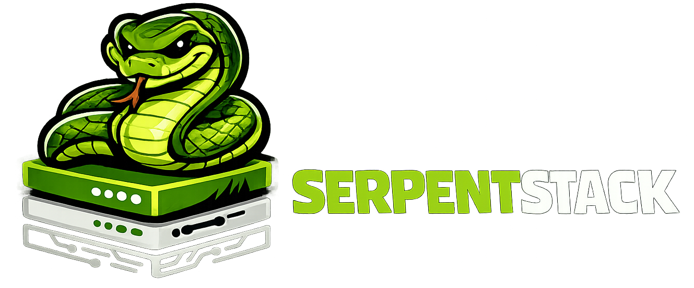

# SerpentStack

<p align="center"></p>

<p align="center">
  <a href="https://github.com/Benja-Pauls/SerpentStack/releases/latest"></a>
  <a href="https://github.com/Benja-Pauls/SerpentStack/actions/workflows/ci.yml"></a>
  <a href="LICENSE"></a>
  
  
</p>

<p align="center">
  <a href="#quick-start">Quick Start</a> &nbsp;·&nbsp;
  <a href="#skills">Skills</a> &nbsp;·&nbsp;
  <a href="#patterns">Patterns</a> &nbsp;·&nbsp;
  <a href="#commands">Commands</a> &nbsp;·&nbsp;
  <a href="#deploy">Deploy</a> &nbsp;·&nbsp;
  <a href="#design-decisions">Design Decisions</a>
</p>

---

AI coding agents start every session cold. They don't know your project layout, your conventions, or why you chose Alembic over raw SQL. They hallucinate file paths, generate patterns that don't match your codebase, and scaffold code you have to rewrite.

SerpentStack is a fullstack template that fixes this with `.skills/` — plain markdown files that give any agent (Claude Code, Cursor, Copilot, Windsurf, whatever) the context it needs to write code that actually fits your project. No vendor lock-in, no plugins, no special tooling. If your agent can read a file, it can read a skill.

The template itself is a production-ready FastAPI + React + Postgres stack with JWT auth, ownership enforcement, async SQLAlchemy, testcontainers, and Terraform deploy. But the point isn't the stack — it's that every decision is documented in `.skills/` so agents reproduce the patterns correctly when you ask them to add features.

```
git clone https://github.com/Benja-Pauls/SerpentStack.git && cd SerpentStack
make init && make setup && make dev
```

## Quick Start

Prerequisites: Python 3.12+, Node 22+, Docker, [uv](https://docs.astral.sh/uv/).

```bash
git clone https://github.com/Benja-Pauls/SerpentStack.git
cd SerpentStack
make init      # interactive setup — project name, DB config
make setup     # install Python (uv) and Node (npm) dependencies
make dev       # start Postgres + Redis + backend + frontend with hot reload
```

Backend at `localhost:8000`, frontend at `localhost:5173`. Working Items CRUD, JWT auth (register/login), and ownership enforcement out of the box. `make verify` runs lint + typecheck + tests for both ends.

## Skills

The `.skills/` directory is what makes this different from every other template. Each skill is a markdown file that teaches an agent how to do something in your project:

| Skill | What it teaches |
|---|---|
| `scaffold/SKILL.md` | How to add a new resource end-to-end (model → schema → service → route → tests → frontend) |
| `auth/SKILL.md` | How auth works, how to protect routes, how to swap JWT for Clerk/Auth0/SSO |
| `test/SKILL.md` | How to run tests, what the fixtures do, how to interpret failures |
| `db-migrate/SKILL.md` | How to create and run Alembic migrations |
| `dev-server/SKILL.md` | Common dev server errors and how to fix them |
| `deploy/SKILL.md` | Docker build → ECR push → Terraform apply |
| `git-workflow/SKILL.md` | Branch naming, commit conventions, PR process |

Agent-specific config files (`.cursorrules`, `.github/copilot-instructions.md`) are also included — these are auto-loaded by their respective agents and contain the architecture overview and key conventions.

Skills are plain markdown. Edit them, delete the ones you don't need, add new ones. A skill is just a `SKILL.md` in a `.skills/` subdirectory.

**Why this works:** When you tell an agent "add a Projects resource," it reads `scaffold/SKILL.md` and generates a model with the right imports, a service that flushes but doesn't commit, a route that checks ownership, and tests without redundant decorators — because the skill told it exactly how. Without skills, it guesses. With skills, it follows your patterns.

## What You Get

```
backend/
  app/
    routes/        # API handlers — thin, delegate to services
    services/      # Business logic — async, no HTTPException, flush-only
    models/        # SQLAlchemy ORM (UUID pks, async sessions)
    schemas/       # Pydantic request/response models
    routes/auth.py # JWT auth: register, login, get_current_user
    worker/        # ARQ async task queue (Redis-backed)
  tests/           # pytest + testcontainers (real Postgres)
  migrations/      # Alembic

frontend/
  src/
    routes/        # Page components (Items, Login, Register)
    api/client.ts  # fetch wrapper with auth token injection
    contexts/      # React AuthContext + useAuth hook
    types/         # Auto-generated from OpenAPI via make types

infra/             # Terraform: App Runner, RDS, ECR, VPC
.skills/           # Agent context (the important part)
```

## Patterns

These are the conventions enforced in `.skills/` and `.cursorrules`. Your agent learns them on first read.

**Services flush, routes commit.** Services call `await db.flush()` but never `db.commit()`. The route handler owns the transaction boundary. This lets you compose multiple service calls atomically.

**Services never raise HTTPException.** They return `None` for not-found, `False` for not-yours, or a domain object for success. Routes translate: `None` → 404, `False` → 403, object → 200.

**Ownership enforcement.** Update and delete require `Depends(get_current_user)` and verify ownership. The three-way return (`True`/`None`/`False` → 204/404/403) is consistent across every resource.

**Auth is one function.** Everything flows through `get_current_user()` → `UserInfo(user_id, email, name, raw_claims)`. Swap JWT for Clerk, Auth0, or SSO by replacing that one dependency. All protected routes keep working.

**Types flow from backend to frontend.** `make types` exports the OpenAPI spec and generates TypeScript types. No manual schema duplication.

## Commands

```bash
make dev             # Postgres + Redis + backend + frontend (hot reload)
make verify          # lint + typecheck + test (both ends) — run before pushing
make test            # just tests
make lint            # ruff (backend) + ESLint (frontend)
make types           # regenerate frontend TypeScript from OpenAPI spec
make migrate         # run Alembic migrations
make migrate-new name="add projects table"  # create a new migration
make seed            # seed DB with sample data
make worker          # start ARQ background task worker
make ui component=button  # add a shadcn/ui component
```

## Deploy

Terraform modules for App Runner, RDS, ECR, and VPC are in `infra/`.

```bash
make deploy-init     # one-time: S3 state bucket + DynamoDB lock table
make deploy          # build → push → terraform apply (defaults to dev)
make deploy env=prod # prod shows plan before applying
```

Standard Docker containers. The AWS modules are a reference — it runs anywhere containers run.

## Design Decisions

| Choice | Why |
|---|---|
| Async SQLAlchemy + asyncpg | AI apps multiplex LLM calls (2-30s each). Async handles thousands of concurrent connections vs ~40 with sync. |
| Testcontainers (real Postgres) | UUID columns, `ON CONFLICT`, JSONB don't exist in SQLite. Real DB in tests catches real bugs. |
| shadcn/ui (zero components installed) | Copies source into your project. `make ui component=X` adds on demand. Delete `components.json` to remove entirely. |
| Domain returns, not exceptions | Services return `None`/`False`, routes translate to HTTP. Services stay reusable in workers, CLI tools, event handlers. |
| `openapi-typescript` | `make types` auto-generates frontend types. No manual schema mirroring. |
| Rate limiting (SlowAPI) | In-memory for dev, Redis for prod. Set `RATE_LIMIT_STORAGE_URI` to switch. |

## Contributing

Contributions welcome — especially new `.skills/`, Terraform modules for GCP/Azure, and agent config files for additional tools. [Open an issue](https://github.com/Benja-Pauls/SerpentStack/issues) for bugs and feature requests.

## License

[MIT](LICENSE)
